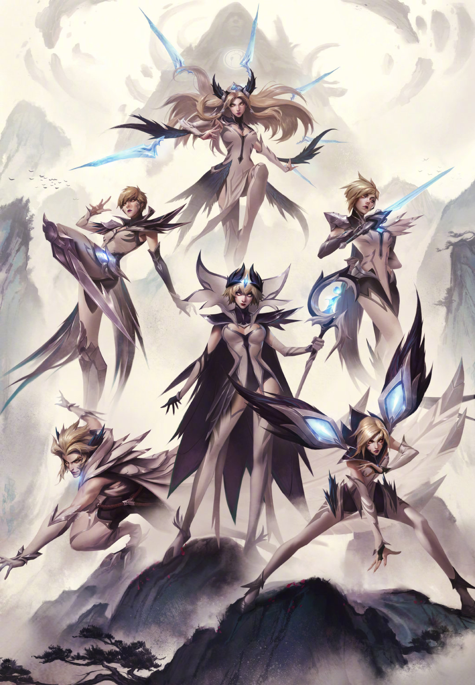

# CSE110 Software Engineering
[README](README.md)
- [CSE110 Software Engineering](#cse110-software-engineering)
  - [Introduction](#introduction)
  - [Hobbies](#hobbies)
  - [Random](#random)
  - [TODO](#todo)
## Introduction

My name is **Bingrui Guo** and don't forget to checkout my [personal page](https://b7guo.github.io/). I was born in Xiamen, China and moved to the bay area at the age of 14. I love techs in general and I am currently very into web devs and backend development.
## Hobbies
1. Video Games
   - 
   - 
   - 
2. Sports
   - Snowboard
   - Basketball
   - Soccer
   - Tennis
## Random
- Which soccer player has a name that is a goat saying yes in Spanish?
    > MEEEEEEEEEE~ Si
- `GreatestCodeOfAllTime = "Hello World!"` 
## TODO
- [x] Lab Week 1
      - 
      - 